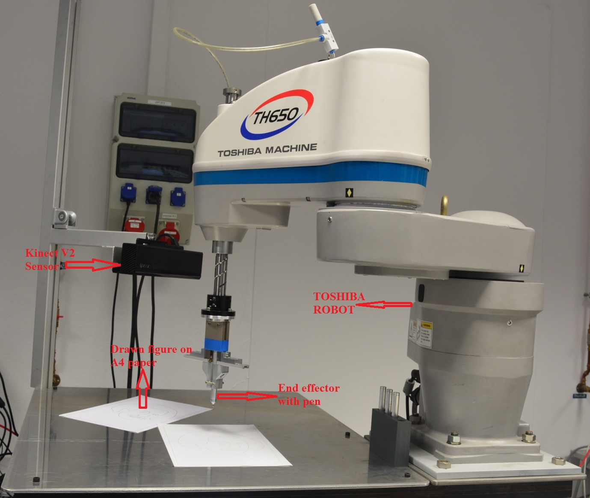
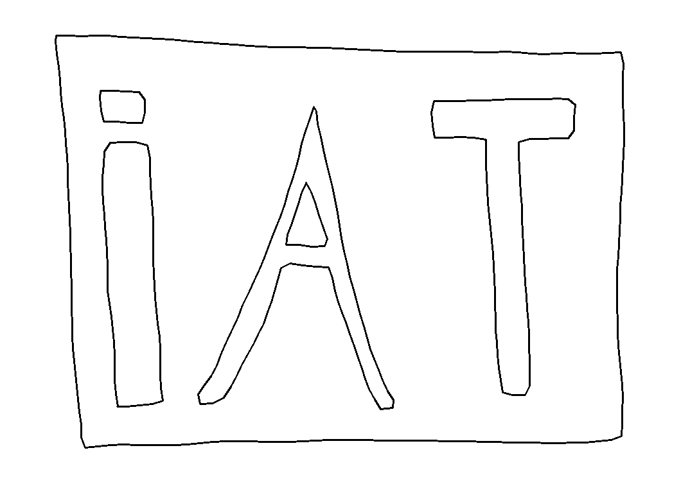

# DESCRIPTION

Toshiba robot used for writing or drawing on a piece of paper. The end effector of the robot holds a pen which is used to write or draw any shape on a A4 sized paper. A hand drawn image on a white sheet of paper is placed beneath the kinect camera, then the image taken by the kinect2 camera is passed on to several nodes for image processing. The extracted coordinates of the pixel from the image are converted to robotic coordinates which are then saved in a text file. For robotic drawing, the generated text file is send into the robotic controller by using the socket communication ros package.

# DEPENDENCIES

• ROS indigo on a computer with Ubuntu 14.04 

http://wiki.ros.org/indigo/Installation/Ubuntu

• Kinect V2 sensor ROS package

https://github.com/code-iai/iai_kinect2

• Opencv 2.4.13 Library

# Procedure to run the package

• First place a A4 sized white paper underneath the Kinect V2 camera

• Open a terminal in ubuntu and type "cd catkin ws"

• Source the catkin workspace by typing "source devel/setup.bash"

• After sourcing the workspace the roslaunch command is used to run the launch file. To run the launch file type " roslaunch recognition and delineation of writings recognition and delineation of writings.launch"

• In a new terminal window type "rosservice call/redirect image". This command captures an image from the kinect V2 camera and publishes it into a topic for image processing.

• After the completion of image processing steps, a text file named "robot_commands.txt" is generated which is saved in a given directory. This text file is then send to the Toshiba robot controller with the help of another ROS socket package robot_communication. In a terminal type "rosrun socket_communication send_command", this will publish the coordinates in the text file on a topic.  

• Finally, in another terminal type "rosrun socket_communication receive_command"

# The setup of the system and one of the writing by the robotic end effector are shown below:

